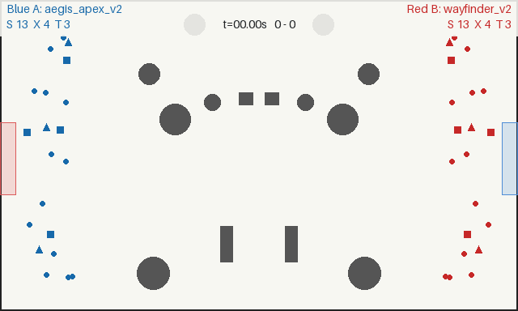

# SwarmBench

SwarmBench is a deterministic, open-source benchmark and Kaggle-style competition for multi-agent swarm control and combat. Two Python controllers command mirrored mixed-class teams through a randomized 100 m × 60 m arena. The authoritative simulator is headless; replays and rendering are separate.



Each team has 10–14 SCOUT vehicles, 4–8 TRANSPORT vehicles, and 2–4 TANK vehicles. A vehicle scores by reaching the opposite goal. All vehicle contacts—including friendly contacts—destroy both participants within 0.75 m. Tanks fire visible, non-piercing 20 m/s projectiles that obstacles or either team's vehicles can intercept. Each Tank carries five shots, cannot fire during the first five seconds, and can fire at most once every four seconds thereafter. The higher score after 90 simulation seconds wins.

| Type | Count | Nominal speed | Nominal acceleration | Nominal jerk | Value |
| --- | ---: | ---: | ---: | ---: | ---: |
| SCOUT | 10–14 | 5.0 m/s | 4.0 m/s² | 16.0 m/s³ | 1 |
| TRANSPORT | 4–8 | 2.5 m/s | 2.0 m/s² | 8.0 m/s³ | 5 |
| TANK | 2–4 | 1.5 m/s | 1.2 m/s² | 4.8 m/s³ | 1 |

Speed, acceleration, and jerk are sampled independently within ±20% of the nominal values once per game and shared by both sides. Counts, dynamics, goals, obstacles, and spawns are reproducible from the one game seed.

## Quick start

SwarmBench targets Python 3.12.

```bash
python -m pip install -e ".[dev,competition,render]"
python -m pytest
python -m swarmbench arena --seed 42 --render arena.png
python -m swarmbench match --controller-a marksman --controller-b convoy --seed 42 --replay match.json --render match.mp4
python -m swarmbench render match.json --output match.gif
```

Rendering defaults to 10 FPS at 640×384. Use `--render-fps 20 --render-quality high` when fidelity matters more than rendering speed. MP4 output uses ffmpeg when available and otherwise falls back to GIF.

Built-in controller names are `rush`, `defend`, `greedy_value`, `assignment`, `potential_field`, `marksman`, and `convoy`.

## Write a controller

A controller is one class with two methods:

```python
from swarmbench import BaseSwarmController, DroneStatus, DroneType


class SwarmController(BaseSwarmController):
    def initialize(self, game_info):
        self.goal = game_info.target_goal

    def step(self, state):
        direction = 1.0 if self.goal.center[0] > 50.0 else -1.0
        target = next((d for d in state.opponent_drones if d.status is DroneStatus.ACTIVE), None)
        actions = {}
        for vehicle in state.own_drones:
            if vehicle.status is not DroneStatus.ACTIVE:
                continue
            command = {"acceleration": (4.0 * direction, 0.0)}
            if vehicle.drone_type is DroneType.TANK and target is not None:
                command["fire_direction"] = (
                    target.position[0] - vehicle.position[0],
                    target.position[1] - vehicle.position[1],
                )
            actions[vehicle.id] = command
        return actions
```

The object persists for one match, so assignments, caches, recurrent state, and loaded models may live on `self`. `step()` receives immutable perfect-information vehicle and projectile snapshots. Movement-only `(ax, ay)` remains valid; structured commands add transient Tank fire requests. See the [Controller API](docs/CONTROLLER_API.md) for validation, command retention, and deadlines.

## Generate a controller with a coding agent

Replace `<OUTPUT_PATH>` with `submissions/<github-login>/<controller-name>.py` before using this prompt. Identify the coding agent or model in the controller name or a top-of-file comment.

```text
You are competing in SwarmBench. Inspect the repository to understand the game
rules, controller API, physics, scoring, projectiles, obstacles, execution
limits, validation tools, and built-in baselines. Implement the strongest valid
and robust controller you can as one Python file at `<OUTPUT_PATH>`.

You may validate it, play matches, inspect results, and iterate, but do not
modify any other repository file, exploit bugs, or violate documented limits.
Optimize for unseen opponents and hidden deterministic seeds rather than known
controllers or test cases. Clearly attribute non-trivial strategy or code drawn
from another controller.
```

## Submit a controller

Open a PR containing exactly one file at `submissions/<github-login>/<controller-name>.py`. Validation checks structure, imports/API, an empty-arena run, timing, and deterministic side-swapped calibration. A trusted reporter maintains a sticky progress comment and enables squash auto-merge after the required `Submission Gate` passes. See the [submission guide](docs/SUBMISSION_GUIDE.md).

## Community leaderboard

Only the latest rating state is committed; permanent tournament history lives in [Tournament Results Discussions](https://github.com/TanWeiXuan/SwarmBenchV2/discussions/categories/tournament-results).

<!-- LEADERBOARD_START -->
| Rank | Controller | Author | Rating | RD | W | D | L | Games |
| ---: | --- | --- | ---: | ---: | ---: | ---: | ---: | ---: |
| 1 | Wayfinder V2 | TanWeiXuan | 1652 | 22 | 158 | 118 | 52 | 328 |
| 2 | Bigpickle V1 | TanWeiXuan | 1611 | 23 | 116 | 91 | 57 | 264 |
| 3 | Aegis Apex V2 | TanWeiXuan | 1587 | 22 | 127 | 151 | 74 | 352 |
| 4 | Sonnet 5 V1 | TanWeiXuan | 1520 | 22 | 110 | 87 | 83 | 280 |
| 5 | Phalanx V2 | TanWeiXuan | 1461 | 22 | 90 | 157 | 113 | 360 |
<!-- LEADERBOARD_END -->

## Reproducibility and security

Scenario identity is `(generator_version, seed)`. Match replays record the sampled scenario dynamics, controller hashes, accepted movement changes, actual shots, events, and final result. SwarmBench seeds Python, NumPy, and PyTorch CPU RNGs where applicable; arbitrary native third-party behavior cannot always be bit-for-bit portable, but the engine is deterministic.

Running third-party controllers locally executes untrusted Python. Official CI uses persistent Docker workers with no network, a read-only filesystem, bounded scratch space, CPU/memory/process limits, and no write credentials or secrets. Static source checks are usability checks, not a security boundary. Read [SECURITY.md](docs/SECURITY.md) before running community code locally.

Detailed rules are in [GAME_SPEC.md](docs/GAME_SPEC.md); tournament design and manual commands are in [TOURNAMENTS.md](docs/TOURNAMENTS.md). SwarmBench is available under the [MIT License](LICENSE).
